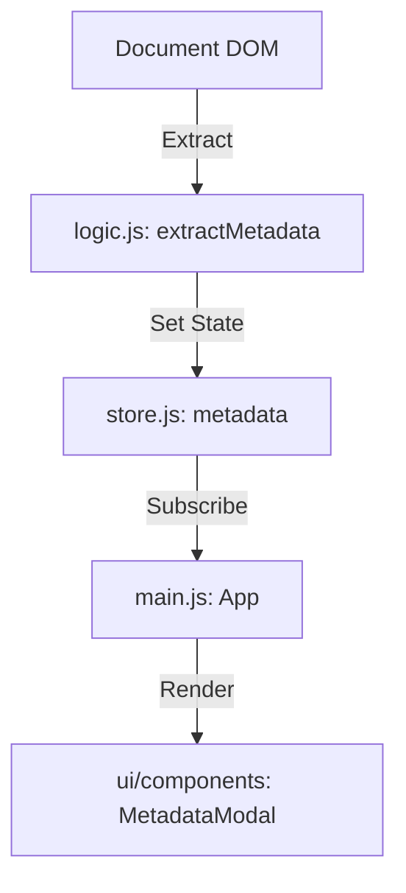

# Design: metadata-view

## Architecture Overview
作品情報を抽出し、Storeを通じてUIに反映させるシンプルな一方向のデータフローを採用します。



## Detailed Design

### 1. Data Structure (Store)
```javascript
metadata: {
  title: string,
  tags: Array<{ text: string, href: string }>,
  relatedWorks: Array<{ title: string, href: string, thumb: string }>
},
isMetadataModalOpen: boolean
```

### 2. Extraction Logic (`logic.js`)
- `h1`: タイトル
- `#post-tag a`: タグ。`href` と `textContent` を取得。
- `.post-list-image`: 関連作品。
  - その親または自身の `a` タグから `href`
  - `img` タグから `src`
  - `span` タグ等からタイトルを取得。

### 3. UI Components
- **InfoButton**: アイコン（例: ⓘ）または "Info" テキストを持つボタン。
- **MetadataModal**:
  - `fixed` 配置の全画面オーバーレイ（`background: rgba(0,0,0,0.5)`）。
  - 中央に配置されるコンテンツカード（`max-width: 80%`, `max-height: 80%`, `overflow-y: auto`）。
  - **Tags**: `display: flex; flex-wrap: wrap;` でチップ状に表示。
  - **Related Works**: `display: grid; grid-template-columns: repeat(auto-fill, minmax(120px, 1fr));` でサムネイル付きで表示。

### 4. Interactions
- Infoボタンクリック: `isMetadataModalOpen: true` に更新。
- モーダル外（オーバーレイ）または閉じるボタンクリック: `false` に更新。
- **Escキー**: モーダルが開いている場合は閉じる。

## Alternatives Considered
- **サイドバー形式**: 閲覧画面を圧迫するため、モーダルの方が「必要な時だけ見る」という用途に適していると判断。
- **ホバー表示**: 情報量が多いため、ホバーでは視認性が悪いと判断。
